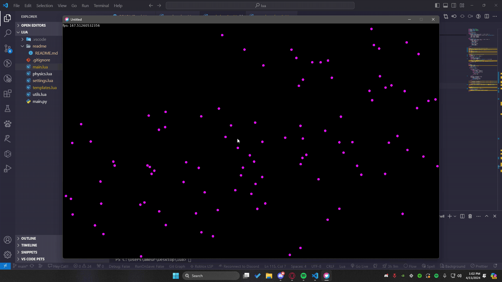

# Particle physics simulator

<small>never realized how awesome lua is </small> 
    

Simple Particle Physics simulator using Lua which includes few laws of physics 

- <a style='color:white;text-decoration:underline' href='https://en.wikipedia.org/wiki/Elastic_collision'>Elastic collision </a>
 

- <a style='color:white;text-decoration:underline' href='https://wikimedia.org/api/rest_v1/media/math/render/svg/4ea196e90833059c9d91cd86bea05e3ec8b75d24'>Elastic collision </a>
 

 